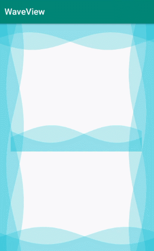

# WaveView

[](https://raw.githubusercontent.com/jenly1314/WaveView/master/app/release/app-release.apk)
[](https://jitpack.io/#jenly1314/WaveView)
[](https://travis-ci.org/jenly1314/WaveView)
[](https://android-arsenal.com/api?level=16)
[](https://opensource.org/licenses/mit-license.php)
[](https://jenly1314.github.io/)
[](http://shang.qq.com/wpa/qunwpa?idkey=8fcc6a2f88552ea44b1411582c94fd124f7bb3ec227e2a400dbbfaad3dc2f5ad)

WaveView for Android 是一个水波纹动画控件视图，支持波纹数，波纹振幅，波纹颜色，波纹速度，波纹方向等属性完全可配。

## Gif 展示



## WaveView自定义属性说明
| 属性 | 值类型 | 默认值 | 说明 |
| :------| :------ | :------ | :------ |
| waveCount | integer |2| 波纹数量 |
| waveColor | color |<font color=#00B9D2>#3F00B9D2</font>| 波纹颜色 |
| waveAmplitude | dimension | 20dp | 波纹振幅 |
| waveMaxSpeed | dimension | 4dp | 波纹最大速度 |
| waveMinSpeed | dimension | 2dp | 波纹最小速度 |
| waveRefreshInterval | integer | 15 | 刷新频率时间间隔，单位:毫秒 |
| waveAutoAnim | boolean | true | 是否自动播放动画 |
| waveInverted | boolean | false | 是否倒置 |
| waveDirection | enum | DIRECTION.LEFT_TO_RIGHT | 波纹方向，默认从左到右 |
| waveVertical | boolean | false | 是否垂直 |


## 引入

### Maven：
```maven
<dependency>
  <groupId>com.king.view</groupId>
  <artifactId>waveview</artifactId>
  <version>1.0.1</version>
  <type>pom</type>
</dependency>
```
### Gradle:
```gradle
implementation 'com.king.view:waveview:1.0.1'
```

### Lvy:
```lvy
<dependency org='com.king.view' name='waveview' rev='1.0.1'>
  <artifact name='$AID' ext='pom'></artifact>
</dependency>
```

###### 如果Gradle出现compile失败的情况，可以在Project的build.gradle里面添加如下：（也可以使用上面的GitPack来complie）
```gradle
allprojects {
    repositories {
        maven { url 'https://dl.bintray.com/jenly/maven' }
    }
}
```

## 示例

布局示例
```Xml
    <com.king.view.waveview.WaveView
        android:id="@+id/waveView"
        android:layout_width="match_parent"
        android:layout_height="wrap_content"/>
```

代码示例
```Java
    //开始动画
    waveView.start();
    //停止动画
    waveView.stop();

```

更多使用详情，请查看[app](app)中的源码使用示例

## 版本记录

#### v1.0.1：2019-11-8
* 移除Support.appcompat-v7依赖

#### v1.0.0：2019-2-23
*  WaveView初始版本

## 赞赏
如果您喜欢WaveView，或感觉WaveView帮助到了您，可以点右上角“Star”支持一下，您的支持就是我的动力，谢谢 :smiley:<p>
您也可以扫描下面的二维码，请作者喝杯咖啡 :coffee:
    <div>
        
        
        
        
    </div>

## 关于我
   Name: <a title="关于作者" href="https://about.me/jenly1314" target="_blank">Jenly</a>

   Email: <a title="欢迎邮件与我交流" href="mailto:jenly1314@gmail.com" target="_blank">jenly1314#gmail.com</a> / <a title="给我发邮件" href="mailto:jenly1314@vip.qq.com" target="_blank">jenly1314#vip.qq.com</a>

   CSDN: <a title="CSDN博客" href="http://blog.csdn.net/jenly121" target="_blank">jenly121</a>

   博客园: <a title="博客园" href="https://www.cnblogs.com/jenly" target="_blank">jenly</a>

   Github: <a title="Github开源项目" href="https://github.com/jenly1314" target="_blank">jenly1314</a>

   加入QQ群: <a title="点击加入QQ群" href="http://shang.qq.com/wpa/qunwpa?idkey=8fcc6a2f88552ea44b1411582c94fd124f7bb3ec227e2a400dbbfaad3dc2f5ad" target="_blank">20867961</a>
   <div>
       
       
   </div>

